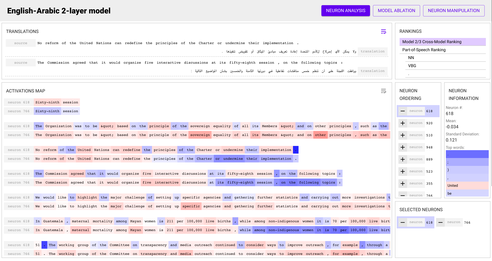

# NeuroX Toolkit


[API Reference](https://neurox.qcri.org/docs/)

NeuroX provide all the necessary tooling to perform Interpretation and Analysis of (Deep) Neural Networks centered around _Probing_. Specifically, the toolkit provides:

- Support for extraction of activation from popular models including the entirety of [transformers](https://github.com/huggingface/transformers), with extended support for other models like [OpenNMT-py](https://github.com/OpenNMT/OpenNMT-py) planned in the near future
- Support for training linear probes on top of these activations, on the entire activation space of a model, on specific layers, or even on specific set of neurons.
- Support for neuron extraction related to specific concepts, using the _Linear Correlation Analysis_ method ([Paper et. al](...)). The toolkit can extract either a local ranking of neurons important to a particular target class, or a global ranking of neurons important to all the target classes.
- Support for ablation analysis by either removing or zeroing out specific neurons to determine their function and importance.
- Support for subword and character level aggregation across a variety of tokenizers, including BPE and all tokenizers in the [transformers](https://github.com/huggingface/transformers) library.
- Support for activation visualization over regular text, to generate qualitative samples of neuron activity over particular sentences.

A demo using a lot of functionality provided by this toolkit [is available](https://neurox.qcri.org/demo).



## Requirements
A [Conda]() environment is provided with all the necessary dependencies for the toolkit. The toolkit primarily relies on PyTorch and NumPy for most of its operations. To create a new environment with all the dependencies, run:

```bash
conda env create -f conda-environment.yml -n neurox-toolkit
conda activate neurox-toolkit
```

If you wish to manage your enviroment in other ways, a standard `requirements.txt` is also provided for use by `pip` directly.

## Getting Started
A Jupyter notebook with a complete example of extracting activations from BERT, training a toy task, extracting neurons and visualizing them is available in [examples/](examples/End to End Example.ipynb) for a quick introduction to the main functionality provided by this toolkit.

## Docs
[API Reference](https://neurox.qcri.org/docs/) contains an API reference for all of the functions exposed by this toolkit. Primarily, the toolkit's functionality is separated into several high-level components:

- Extraction
- Data Preprocessing
- Linear Probing
- Neuron extraction and interpretation
- Neuron cluster analysis
- Visualization

## Citation

Please cite our paper published at AAAI'19 if you use this toolkit.

```
@article{dalvi2019neurox,
  title={NeuroX: A Toolkit for Analyzing Individual Neurons in Neural Networks},
  author={Dalvi, Fahim
    and Nortonsmith, Avery
    and Bau, D Anthony
    and Belinkov, Yonatan
    and Sajjad, Hassan
    and Durrani, Nadir
    and Glass, James},
  journal={Proceedings of the AAAI Conference on Artificial Intelligence (AAAI)},
  year={2019}
}
```

## Planned features

[ ] Pip package
[ ] Support for OpenNMT-py models
[ ] Support for control tasks and computing metrics like selectivity
[ ] Support for attention and other module analysis
